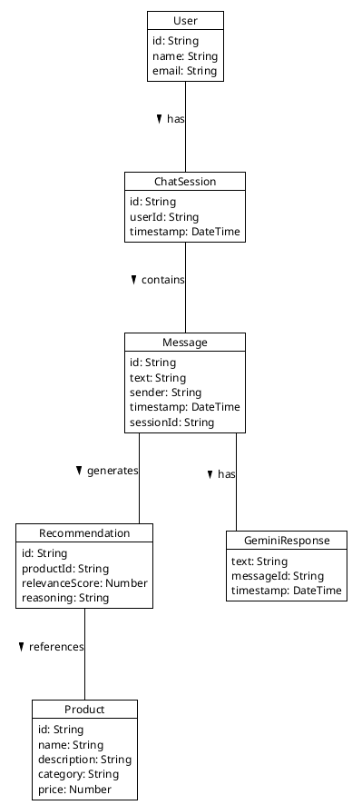
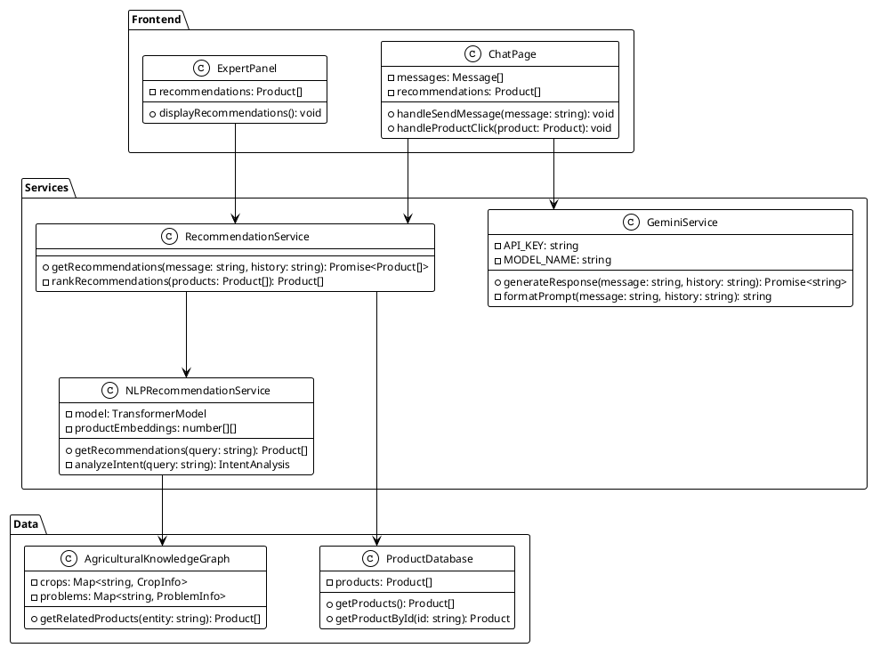
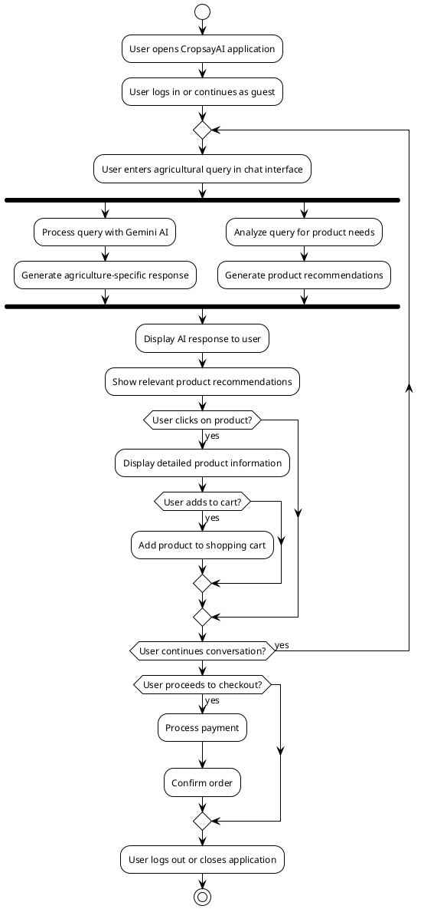
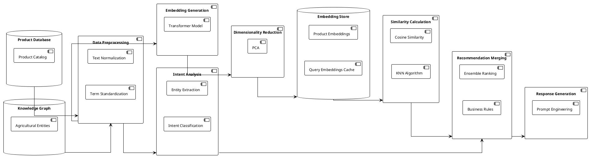
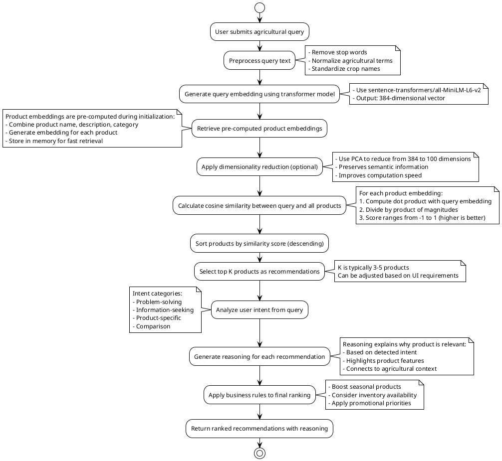

# CropsayAI System Diagrams

This document contains diagrams of the CropsayAI system with detailed explanations.

## Object Diagram

The Object Diagram illustrates the key data entities in the CropsayAI system and their relationships.

**Detailed Explanation:**
- **User**: Represents an end user with attributes like id, name, and email. Each user can have multiple chat sessions.
- **ChatSession**: Represents a conversation between a user and the AI, containing a unique id, reference to the user, and a timestamp.
- **Message**: Represents individual messages within a chat session, with content, sender identifier, timestamp, and session reference.
- **Product**: Represents agricultural products in the catalog with attributes like id, name, description, category, and price.
- **Recommendation**: Represents product recommendations generated by the AI, including product reference, relevance score, and reasoning.
- **GeminiResponse**: Represents the response generated by the Gemini AI model, containing response text and metadata.

The relationships show that a User has many ChatSessions, a ChatSession contains many Messages, a Message can generate multiple Recommendations, a Message has one GeminiResponse, and a Recommendation references one Product.



## Class Diagram

The Class Diagram shows the software architecture of CropsayAI, organized into packages for Frontend, Services, and Data.

**Detailed Explanation:**
- **Frontend Package**: Contains UI-related classes that handle user interactions and display.
  - **ChatPage**: The main chat interface that displays messages and recommendations. It has methods to handle sending messages and clicking on products.
  - **ExpertPanel**: A component that displays product recommendations to the user.

- **Services Package**: Contains the core business logic and service classes.
  - **GeminiService**: Handles communication with Google's Gemini AI model. It has methods to generate responses based on user messages and conversation history.
  - **RecommendationService**: Manages product recommendations based on user queries. It has methods to get recommendations and rank them by relevance.
  - **NLPRecommendationService**: Provides advanced natural language processing for recommendations. It uses a transformer model to generate embeddings for products and queries.

- **Data Package**: Contains classes that manage data access and storage.
  - **AgriculturalKnowledgeGraph**: Stores structured information about agricultural concepts like crops and problems. It has methods to retrieve related products based on agricultural entities.
  - **ProductDatabase**: Manages the product catalog with methods to retrieve products by ID or category.

The arrows show dependencies between classes, such as ChatPage depending on GeminiService and RecommendationService, and NLPRecommendationService depending on AgriculturalKnowledgeGraph.



## User Workflow Diagram

The User Workflow Diagram illustrates the end-to-end journey of a user interacting with the CropsayAI system.

**Detailed Explanation:**
This diagram shows the complete user journey through the CropsayAI application:

1. **Application Entry**: The user opens the CropsayAI application and either logs in or continues as a guest.

2. **Conversation Loop**: The user enters into a repeating conversation cycle:
   - The user enters an agricultural query in the chat interface
   - The system processes the query in two parallel paths:
     - Using Gemini AI to generate an agriculture-specific response
     - Analyzing the query to identify product needs and generate recommendations
   - The system displays the AI response and relevant product recommendations
   - The user may click on a product to view detailed information
   - If interested, the user may add the product to their shopping cart
   - The user decides whether to continue the conversation or proceed to checkout

3. **Checkout Process**: If the user decides to proceed to checkout:
   - The system processes the payment
   - The system confirms the order

4. **Application Exit**: The user logs out or closes the application

The diagram uses decision points (diamonds) to show where the user makes choices that affect the flow, such as whether to click on a product, add a product to the cart, continue the conversation, or proceed to checkout.



## Data Pipeline Diagram

The Data Pipeline Diagram illustrates how data flows through the CropsayAI system, from raw product and knowledge data to processed recommendations.

**Detailed Explanation:**
This diagram shows the complete data processing pipeline for generating product recommendations:

1. **Data Sources**:
   - **Product Database**: Contains the catalog of agricultural products with their details
   - **Knowledge Graph**: Contains structured information about agricultural entities and their relationships

2. **Data Preprocessing**:
   - **Text Normalization**: Standardizes text by removing special characters, converting to lowercase, etc.
   - **Term Standardization**: Normalizes agricultural terms to standard forms (e.g., "tomato blight" → "Phytophthora infestans")

3. **Embedding Generation**:
   - **Transformer Model**: Uses a neural network to convert text into numerical vector representations (embeddings)

4. **Dimensionality Reduction**:
   - **PCA (Principal Component Analysis)**: Reduces the dimensionality of embeddings from 384 to 100 dimensions while preserving semantic information

5. **Embedding Storage**:
   - **Product Embeddings**: Stores pre-computed embeddings for all products
   - **Query Embeddings Cache**: Temporarily stores embeddings for user queries

6. **Similarity Calculation**:
   - **Cosine Similarity**: Calculates how similar two embeddings are by measuring the cosine of the angle between them
   - **KNN Algorithm**: Finds the K-Nearest Neighbors (most similar products) to the query

7. **Intent Analysis**:
   - **Entity Extraction**: Identifies agricultural entities mentioned in the query
   - **Intent Classification**: Determines the user's intent (problem-solving, information-seeking, etc.)

8. **Recommendation Merging**:
   - **Ensemble Ranking**: Combines recommendations from multiple sources
   - **Business Rules**: Applies business logic like seasonal relevance and inventory availability

9. **Response Generation**:
   - **Prompt Engineering**: Creates prompts for the Gemini AI to generate explanations for recommendations

The arrows show the flow of data through the pipeline, with each component processing the data and passing it to the next stage.



## KNN Algorithm Workflow

The KNN Algorithm Workflow Diagram illustrates the step-by-step process of the K-Nearest Neighbors algorithm used in CropsayAI for product recommendations.

**Detailed Explanation:**
This diagram shows the detailed workflow of the KNN algorithm:

1. **Query Processing**:
   - The process begins when a user submits an agricultural query
   - The query text is preprocessed by removing stop words, normalizing agricultural terms, and standardizing crop names
   - A transformer model (sentence-transformers/all-MiniLM-L6-v2) generates a 384-dimensional vector embedding for the query

2. **Product Embedding Retrieval**:
   - The system retrieves pre-computed embeddings for all products in the catalog
   - These embeddings are generated during system initialization by combining product name, description, and category information
   - The embeddings are stored in memory for fast retrieval

3. **Dimensionality Reduction**:
   - Optionally, PCA (Principal Component Analysis) is applied to reduce the dimensionality of embeddings from 384 to 100 dimensions
   - This preserves semantic information while improving computation speed

4. **Similarity Calculation**:
   - The system calculates cosine similarity between the query embedding and all product embeddings
   - For each product, it computes the dot product of the embeddings, divides by the product of their magnitudes, and gets a score between -1 and 1
   - Higher scores indicate greater similarity

5. **Ranking and Selection**:
   - Products are sorted by similarity score in descending order
   - The top K products (typically 3-5) are selected as recommendations

6. **Intent Analysis**:
   - The system analyzes the user's intent from the query, categorizing it as problem-solving, information-seeking, product-specific, or comparison

7. **Reasoning Generation**:
   - For each recommended product, the system generates reasoning text explaining why it's relevant
   - The reasoning is based on the detected intent, product features, and agricultural context

8. **Business Rule Application**:
   - The system applies business rules to the final ranking, such as boosting seasonal products, considering inventory availability, and applying promotional priorities

9. **Result Return**:
   - The system returns the ranked recommendations with reasoning to be displayed to the user

The notes provide additional details about each step, explaining the specific techniques and considerations involved.



## System Architecture Overview

The System Architecture Overview Diagram provides a high-level view of the CropsayAI system architecture. It shows the layered structure of the system, from frontend to data layer, and the relationships between different layers.

**Detailed Explanation:**
This diagram shows the layered architecture of the CropsayAI system:

1. **Frontend Layer**:
   - **React UI Components**: The user interface elements that users interact with
   - **State Management**: Manages the application state using React Context API
   - **API Client**: Handles communication with backend services

2. **Service Layer**:
   - **Gemini Service**: Manages interactions with Google's Gemini AI model
   - **Recommendation Service**: Coordinates product recommendations from multiple sources
   - **Chat Service**: Manages chat sessions and message persistence
   - **Authentication Service**: Handles user authentication and authorization

3. **Integration Layer**:
   - **Gemini Proxy**: Acts as an intermediary between the application and Google's API
   - **NLP Bridge**: Connects to the Python NLP service
   - **Supabase Client**: Provides an interface to the Supabase backend

4. **External Services**:
   - **Google Gemini API**: Google's AI service that provides the language model
   - **Python NLP Service**: Python-based service for advanced natural language processing
   - **Supabase**: External service for database and authentication

5. **Data Layer**:
   - **Product Database**: Stores information about agricultural products
   - **Agricultural Knowledge Graph**: Stores structured knowledge about agricultural concepts
   - **User Data**: Stores user account information
   - **Chat History**: Stores conversation history

The arrows show the dependencies between components, with each layer depending on the layers below it. This layered architecture provides separation of concerns, making the system more maintainable and scalable.

```plantuml
@startuml System Architecture Overview
!theme plain
skinparam monochrome true
skinparam shadowing false
skinparam defaultFontName Arial
skinparam defaultFontSize 12
skinparam backgroundColor white
skinparam PackageBackgroundColor white
skinparam PackageBorderColor black
skinparam ArrowColor black
skinparam linetype ortho
skinparam nodesep 70
skinparam ranksep 90

top to bottom direction

package "Frontend Layer" {
  [React UI Components]
  [State Management]
  [API Client]
}

package "Service Layer" {
  [Gemini Service]
  [Recommendation Service]
  [Chat Service]
  [Authentication Service]
}

package "Integration Layer" {
  [Gemini Proxy]
  [NLP Bridge]
  [Supabase Client]
}

package "External Services" {
  [Google Gemini API]
  [Python NLP Service]
  [Supabase]
}

package "Data Layer" {
  [Product Database]
  [Agricultural Knowledge Graph]
  [User Data]
  [Chat History]
}

[React UI Components] --> [State Management]
[State Management] --> [API Client]

[API Client] --> [Gemini Service]
[API Client] --> [Recommendation Service]
[API Client] --> [Chat Service]
[API Client] --> [Authentication Service]

[Gemini Service] --> [Gemini Proxy]
[Recommendation Service] --> [NLP Bridge]
[Chat Service] --> [Supabase Client]
[Authentication Service] --> [Supabase Client]

[Gemini Proxy] --> [Google Gemini API]
[NLP Bridge] --> [Python NLP Service]
[Supabase Client] --> [Supabase]

[Python NLP Service] --> [Product Database]
[Python NLP Service] --> [Agricultural Knowledge Graph]
[Supabase] --> [User Data]
[Supabase] --> [Chat History]

@enduml
