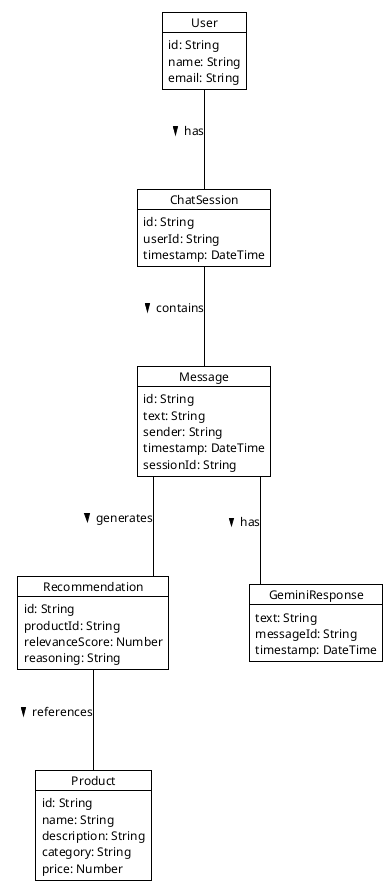
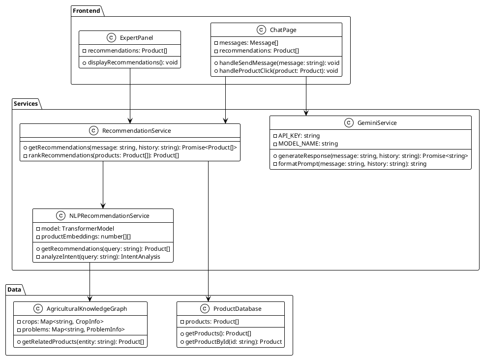
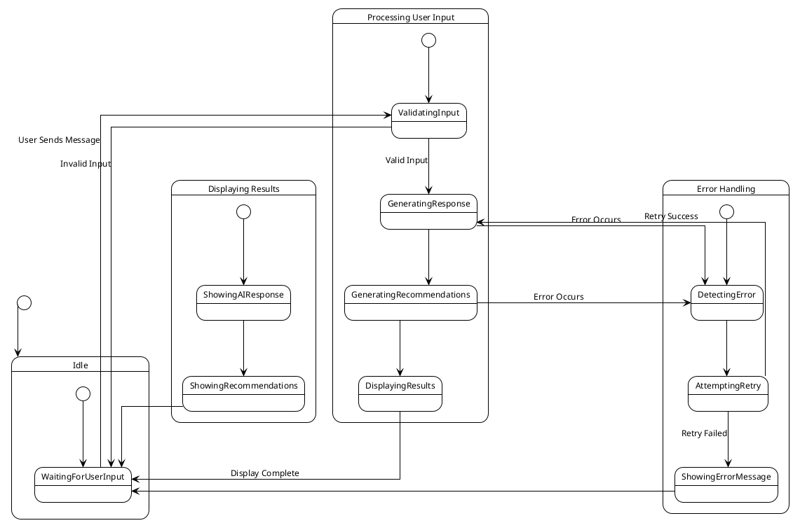
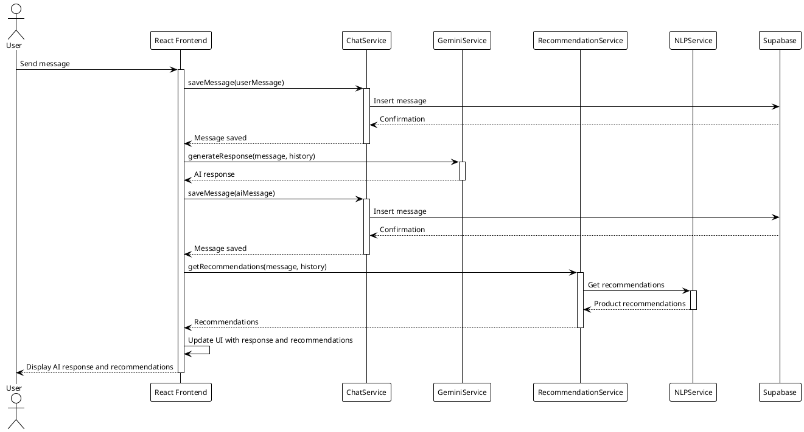
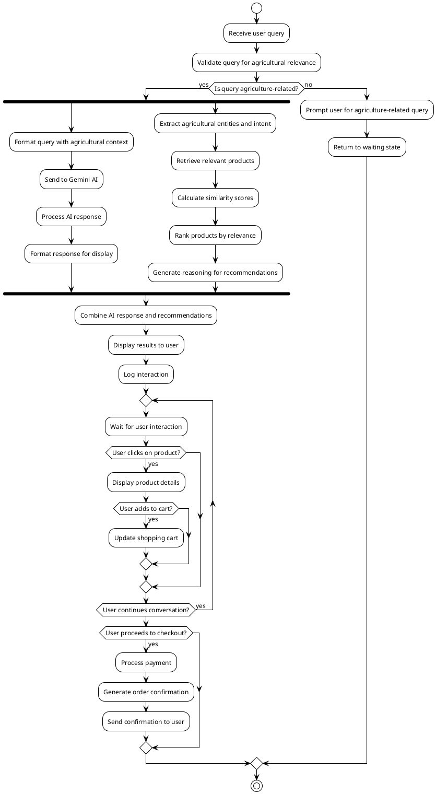
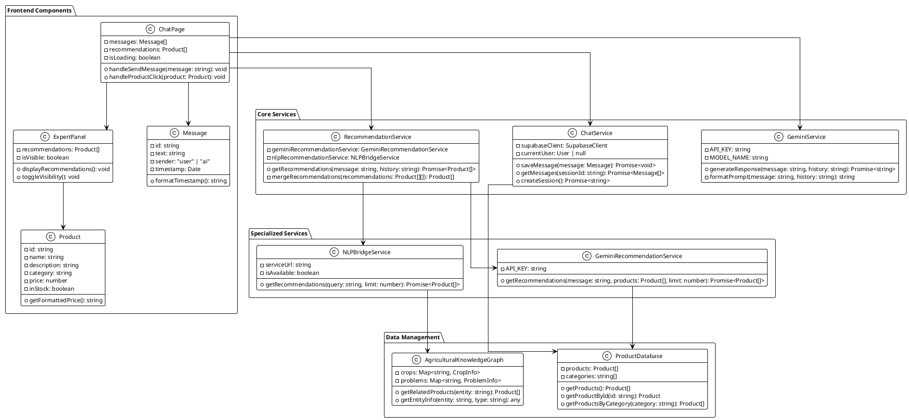
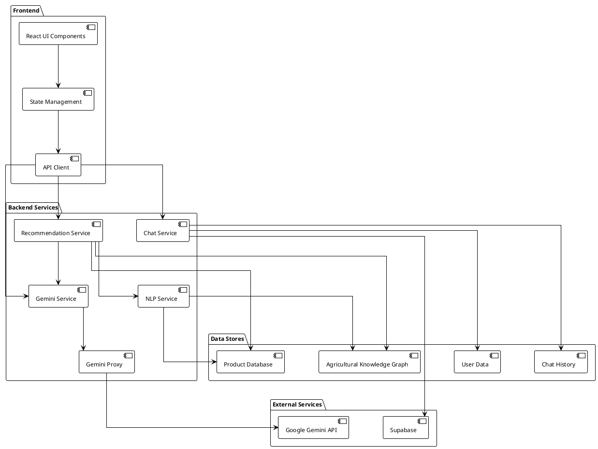

# CropsayAI System Diagrams

This document contains diagrams of the CropsayAI system with detailed explanations.

## Object Diagram

The Object Diagram illustrates the key data entities in the CropsayAI system and their relationships.

**Detailed Explanation:**
- **User**: Represents an end user with attributes like id, name, and email. Each user can have multiple chat sessions.
- **ChatSession**: Represents a conversation between a user and the AI, containing a unique id, reference to the user, and a timestamp.
- **Message**: Represents individual messages within a chat session, with content, sender identifier, timestamp, and session reference.
- **Product**: Represents agricultural products in the catalog with attributes like id, name, description, category, and price.
- **Recommendation**: Represents product recommendations generated by the AI, including product reference, relevance score, and reasoning.
- **GeminiResponse**: Represents the response generated by the Gemini AI model, containing response text and metadata.



## Class Diagram

The Class Diagram shows the software architecture of CropsayAI, organized into packages for Frontend, Services, and Data.

**Detailed Explanation:**
- **Frontend Package**: Contains UI-related classes that handle user interactions and display.
- **Services Package**: Contains the core business logic and service classes.
- **Data Package**: Contains classes that manage data access and storage.



## State Diagram

The State Diagram depicts the different states of the CropsayAI chat system and the transitions between them.

**Detailed Explanation:**
This diagram shows how the system changes states during user interaction, from idle to processing input, displaying results, and handling errors.



## Sequence Diagram

The Sequence Diagram illustrates the interaction between different components of the CropsayAI system over time.

**Detailed Explanation:**
This diagram shows the precise sequence of operations that occur when a user sends a message, including message storage, AI response generation, and recommendation generation.



## Activity Diagram

The Activity Diagram shows the flow of activities in the CropsayAI system, focusing on the processing of user queries and generation of responses and recommendations.

**Detailed Explanation:**
This diagram illustrates the step-by-step activities that occur when processing a user query, including parallel processing paths for AI response generation and recommendation generation.



## Refinement of Classes and Objects

The Refinement of Classes and Objects Diagram provides a more detailed view of the CropsayAI class structure, showing additional attributes, methods, and relationships between classes.

**Detailed Explanation:**
This diagram expands on the basic class diagram by providing more implementation details for frontend components, core services, specialized services, and data management.



## Component Diagram

The Component Diagram shows the high-level components of the CropsayAI system and their dependencies.

**Detailed Explanation:**
This diagram provides a comprehensive view of the system's architecture at the component level, showing how frontend components, backend services, external services, and data stores interact with each other.



## System Architecture Overview

The System Architecture Overview Diagram provides a high-level view of the CropsayAI system architecture. It shows the layered structure of the system, from frontend to data layer, and the relationships between different layers.

**Detailed Explanation:**
This diagram shows the layered architecture of the CropsayAI system, including the Frontend Layer, Service Layer, Integration Layer, External Services, and Data Layer.

```plantuml
@startuml System Architecture Overview
!theme plain
skinparam monochrome true
skinparam shadowing false
skinparam defaultFontName Arial
skinparam defaultFontSize 12
skinparam backgroundColor white
skinparam PackageBackgroundColor white
skinparam PackageBorderColor black
skinparam ArrowColor black
skinparam linetype ortho
skinparam nodesep 70
skinparam ranksep 90

top to bottom direction

package "Frontend Layer" {
  [React UI Components]
  [State Management]
  [API Client]
}

package "Service Layer" {
  [Gemini Service]
  [Recommendation Service]
  [Chat Service]
  [Authentication Service]
}

package "Integration Layer" {
  [Gemini Proxy]
  [NLP Bridge]
  [Supabase Client]
}

package "External Services" {
  [Google Gemini API]
  [Python NLP Service]
  [Supabase]
}

package "Data Layer" {
  [Product Database]
  [Agricultural Knowledge Graph]
  [User Data]
  [Chat History]
}

[React UI Components] --> [State Management]
[State Management] --> [API Client]

[API Client] --> [Gemini Service]
[API Client] --> [Recommendation Service]
[API Client] --> [Chat Service]
[API Client] --> [Authentication Service]

[Gemini Service] --> [Gemini Proxy]
[Recommendation Service] --> [NLP Bridge]
[Chat Service] --> [Supabase Client]
[Authentication Service] --> [Supabase Client]

[Gemini Proxy] --> [Google Gemini API]
[NLP Bridge] --> [Python NLP Service]
[Supabase Client] --> [Supabase]

[Python NLP Service] --> [Product Database]
[Python NLP Service] --> [Agricultural Knowledge Graph]
[Supabase] --> [User Data]
[Supabase] --> [Chat History]

@enduml
