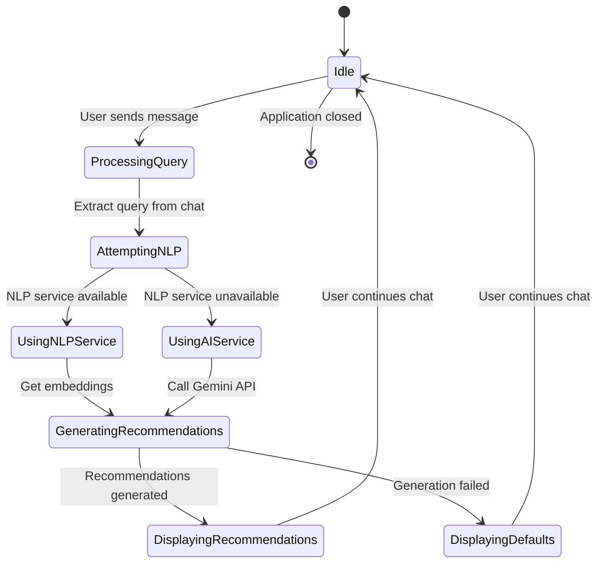
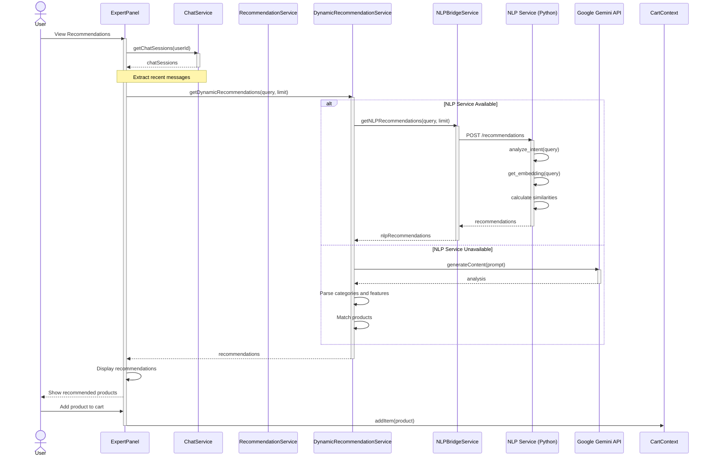
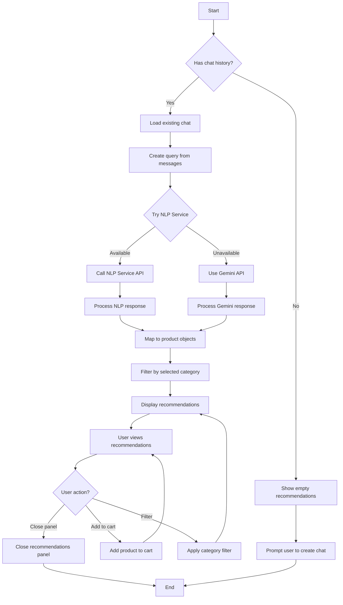
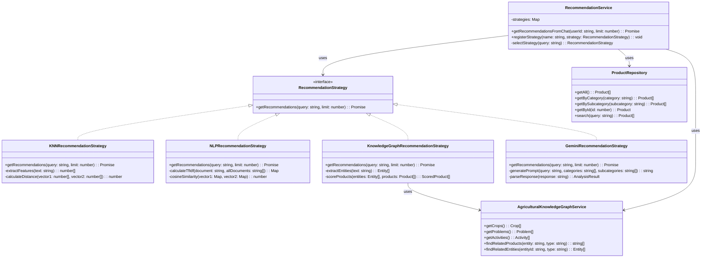
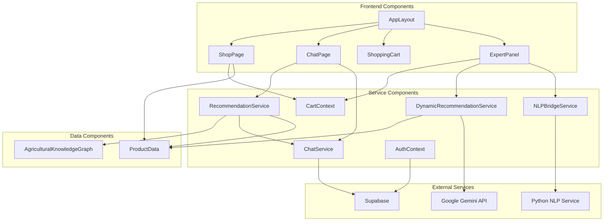

# CropsayAI System Analysis and Design Diagrams

## 3.1.3 Object Modeling: Object & Class Diagram

The class diagram illustrates the key classes and their relationships in the CropsayAI system:

```mermaid
classDiagram
    class Product {
        +id: number
        +name: string
        +description: string
        +category: string
        +subcategory: string
        +price: number
        +rating: number
        +image: string
    }
    
    class AgriculturalKnowledgeGraph {
        +crops: Crop[]
        +problems: Problem[]
        +activities: Activity[]
    }
    
    class Crop {
        +id: string
        +name: string
        +scientificName: string
        +growingSeason: string[]
        +commonProblems: string[]
        +relatedProducts: string[]
    }
    
    class Problem {
        +id: string
        +name: string
        +description: string
        +affectedCrops: string[]
        +solutions: string[]
        +relatedProducts: string[]
    }
    
    class Activity {
        +id: string
        +name: string
        +description: string
        +relatedCrops: string[]
        +relatedProducts: string[]
        +season: string[]
    }
    
    class RecommendationService {
        +getRecommendationsFromChat(userId: string, limit: number): Promise<Product[]>
        -extractKeywords(text: string): string[]
        -getCategoriesFromKeywords(keywords: string[]): string[]
        -calculateTfIdf(document: string, allDocuments: string[]): Map<string, number>
        -cosineSimilarity(vector1: Map<string, number>, vector2: Map<string, number>): number
        -getRecommendationsUsingKNN(chatText: string, limit: number): Product[]
        -getRecommendationsUsingNLP(chatText: string, limit: number): Product[]
        -getRecommendationsUsingKnowledgeGraph(chatText: string, limit: number): Product[]
    }
    
    class DynamicRecommendationService {
        +getDynamicRecommendations(query: string, limit: number): Promise<Product[]>
        -getDefaultRecommendations(limit: number): Product[]
    }
    
    class NLPBridgeService {
        +getNLPRecommendations(query: string, limit: number): Promise<Product[]>
        -callNLPService(query: string, limit: number): Promise<RecommendationResponse>
    }
    
    class ChatService {
        +getChatSessions(userId: string): Promise<ChatSession[]>
        +createChatSession(userId: string): Promise<ChatSession>
        +addMessage(sessionId: string, message: ChatMessage): Promise<void>
    }
    
    class CartContext {
        +items: CartItem[]
        +addItem(product: Product): void
        +removeItem(productId: number): void
        +updateQuantity(productId: number, quantity: number): void
        +clearCart(): void
    }
    
    class ExpertPanel {
        +isOpen: boolean
        +title: string
        +onClose(): void
        -handleChatNow(expert: Expert): void
        -handleSchedule(expert: Expert): void
        -handleAddToCart(product: Product): void
        -loadRecommendations(): void
    }
    
    class Expert {
        +id: string
        +name: string
        +role: string
        +experience: string
        +languages: string[]
        +rating: number
        +image: string
    }
    
    class ChatSession {
        +id: string
        +userId: string
        +timestamp: Date
        +messages: ChatMessage[]
    }
    
    class ChatMessage {
        +id: string
        +sessionId: string
        +content: string
        +role: string
        +timestamp: Date
    }
    
    AgriculturalKnowledgeGraph "1" -- "many" Crop: contains
    AgriculturalKnowledgeGraph "1" -- "many" Problem: contains
    AgriculturalKnowledgeGraph "1" -- "many" Activity: contains
    
    RecommendationService --> Product: recommends
    RecommendationService --> AgriculturalKnowledgeGraph: uses
    DynamicRecommendationService --> Product: recommends
    NLPBridgeService --> Product: recommends
    
    ExpertPanel --> Expert: displays
    ExpertPanel --> CartContext: uses
    ExpertPanel --> DynamicRecommendationService: uses
    ExpertPanel --> NLPBridgeService: uses
    
    ChatService --> ChatSession: manages
    ChatSession --> ChatMessage: contains
    
    CartContext --> Product: contains
```



## 3.1.4 Dynamic Modeling: State & Sequence Diagrams

### State Diagram

The following state diagram illustrates the states of the recommendation system:



### Sequence Diagram

The following sequence diagram illustrates the process of generating product recommendations based on user chat:



## 3.1.5 Process Modeling: Activity Diagram

The following activity diagram illustrates the process of generating and displaying recommendations:



## 3.2.1 Refinement of Classes and Objects

The CropsayAI system refines the classes and objects identified in the object modeling phase to ensure they meet the system requirements. Key refinements include:



## 3.2.2 Component Diagram

The following component diagram illustrates the main components of the CropsayAI system and their interactions:



## 3.2.3 Deployment Diagram

The following deployment diagram illustrates how the CropsayAI system is deployed:

```mermaid
graph TD
    subgraph "Client Device"
        Browser[Web Browser]
    end
    
    subgraph "Web Server"
        Frontend[React Frontend]
        JSServices[JavaScript Services]
    end
    
    subgraph "NLP Server"
        PythonService[Python NLP Service]
        TransformerModels[Transformer Models]
    end
    
    subgraph "External Services"
        GeminiAPI[Google Gemini API]
        SupabaseDB[Supabase Database]
    end
    
    Browser <--> Frontend: HTTPS
    Frontend <--> JSServices: Internal
    JSServices <--> PythonService: HTTP
    JSServices <--> GeminiAPI: HTTPS
    JSServices <--> SupabaseDB: HTTPS
    PythonService <--> TransformerModels: Internal