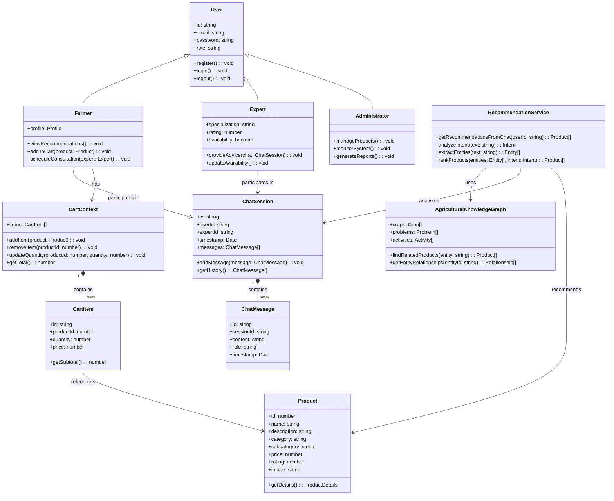
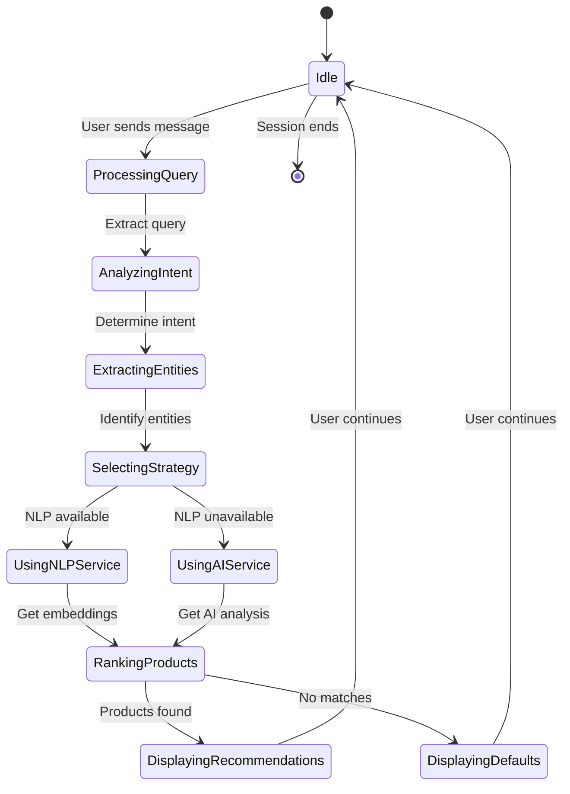
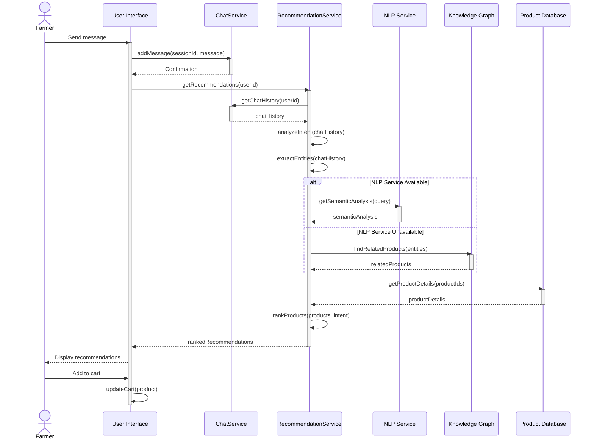
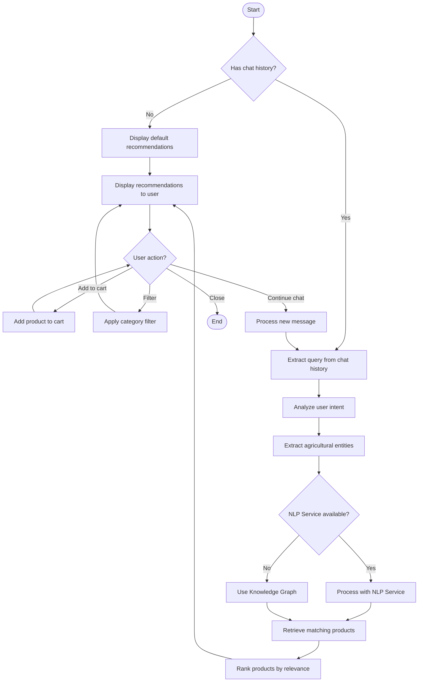
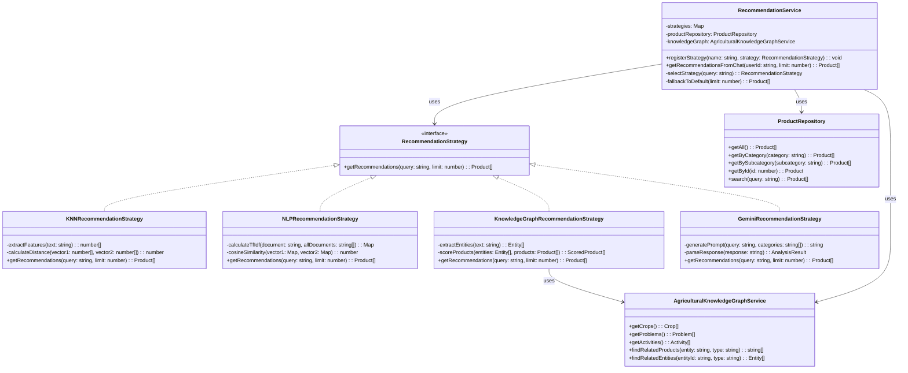

# CropsayAI System Analysis and Design Diagrams

## 3.1.1 Use-Case Modeling

### Use-Case Diagram

The following use-case diagram illustrates the main actors and use cases in the CropsayAI system:

```mermaid
actor Farmer
actor "Agricultural Expert" as Expert
actor Administrator

rectangle "CropsayAI System" {
  usecase "Register/Login" as UC1
  usecase "Chat with Expert" as UC2
  usecase "View Recommendations" as UC3
  usecase "Add Products to Cart" as UC4
  usecase "Manage Profile" as UC5
  usecase "Provide Expert Advice" as UC6
  usecase "Schedule Consultation" as UC7
  usecase "Manage Product Catalog" as UC8
  usecase "Monitor System" as UC9
}

Farmer --> UC1
Farmer --> UC2
Farmer --> UC3
Farmer --> UC4
Farmer --> UC5
Farmer --> UC7

Expert --> UC1
Expert --> UC2
Expert --> UC6
Expert --> UC7

Administrator --> UC1
Administrator --> UC8
Administrator --> UC9
```

### Use-Case Descriptions

#### UC1: Register/Login
**Actor:** Farmer, Expert, Administrator  
**Description:** Users can create an account or log in to an existing account.  
**Preconditions:** User has internet access and has downloaded the application.  
**Main Flow:**
1. User opens the application
2. User selects "Register" or "Login"
3. For registration:
   - User provides email, password, and profile information
   - System validates the information
   - System creates a new account
4. For login:
   - User provides email and password
   - System validates credentials
   - System grants access to the application
**Alternative Flows:**
- If validation fails, system displays appropriate error message
- User can request password reset if forgotten
**Postconditions:** User is authenticated and can access the system.

#### UC2: Chat with Expert
**Actor:** Farmer, Expert  
**Description:** Farmers can chat with agricultural experts to get advice on farming issues.  
**Preconditions:** User is logged in.  
**Main Flow:**
1. Farmer navigates to the chat section
2. Farmer selects an available expert
3. Farmer sends messages describing their agricultural situation
4. Expert receives messages and responds with advice
5. System analyzes chat content for product recommendations
**Alternative Flows:**
- If no experts are available, farmer can schedule a consultation for later
- If farmer prefers, they can chat with AI assistant instead of human expert
**Postconditions:** Farmer receives expert advice and system generates relevant product recommendations.

#### UC3: View Recommendations
**Actor:** Farmer  
**Description:** Farmers can view personalized product recommendations based on their chat history.  
**Preconditions:** User is logged in and has chat history.  
**Main Flow:**
1. Farmer navigates to recommendations panel
2. System analyzes farmer's chat history
3. System generates personalized product recommendations
4. Farmer views recommended products with details
5. Farmer can filter recommendations by category
**Alternative Flows:**
- If farmer has no chat history, system shows default recommendations
- Farmer can refresh recommendations after new chat interactions
**Postconditions:** Farmer sees relevant agricultural products that address their needs.

#### UC4: Add Products to Cart
**Actor:** Farmer  
**Description:** Farmers can add recommended products to their shopping cart.  
**Preconditions:** User is logged in and viewing product recommendations.  
**Main Flow:**
1. Farmer selects a recommended product
2. Farmer clicks "Add to Cart" button
3. System adds product to farmer's cart
4. System updates cart count and total
5. Farmer can continue shopping or proceed to checkout
**Alternative Flows:**
- Farmer can adjust quantity of products in cart
- Farmer can remove products from cart
**Postconditions:** Selected products are added to farmer's shopping cart.

#### UC5: Manage Profile
**Actor:** Farmer  
**Description:** Farmers can view and update their profile information.  
**Preconditions:** User is logged in.  
**Main Flow:**
1. Farmer navigates to profile section
2. Farmer views current profile information
3. Farmer edits information as needed
4. System validates and saves changes
**Alternative Flows:**
- If validation fails, system displays appropriate error message
**Postconditions:** Farmer's profile information is updated.

#### UC6: Provide Expert Advice
**Actor:** Expert  
**Description:** Agricultural experts can provide advice to farmers through the chat interface.  
**Preconditions:** Expert is logged in.  
**Main Flow:**
1. Expert views list of active chat requests
2. Expert selects a chat to respond to
3. Expert reads farmer's messages
4. Expert provides advice and recommendations
5. System records the interaction
**Alternative Flows:**
- Expert can schedule follow-up consultations if needed
- Expert can refer farmer to other experts for specialized advice
**Postconditions:** Farmer receives expert advice for their agricultural issues.

#### UC7: Schedule Consultation
**Actor:** Farmer, Expert  
**Description:** Users can schedule consultations for more in-depth discussions.  
**Preconditions:** User is logged in.  
**Main Flow:**
1. User navigates to scheduling section
2. User selects available time slot
3. User provides consultation topic and details
4. System confirms the appointment
5. System sends notifications to both parties
**Alternative Flows:**
- If selected time is no longer available, system suggests alternative times
- Users can reschedule or cancel appointments
**Postconditions:** Consultation is scheduled and both parties are notified.

#### UC8: Manage Product Catalog
**Actor:** Administrator  
**Description:** Administrators can add, update, or remove products from the catalog.  
**Preconditions:** Administrator is logged in.  
**Main Flow:**
1. Administrator navigates to product management section
2. Administrator can view existing products
3. Administrator can add new products with details
4. Administrator can update product information
5. Administrator can remove products from catalog
**Alternative Flows:**
- Administrator can import products in bulk
- Administrator can categorize products
**Postconditions:** Product catalog is updated with changes.

#### UC9: Monitor System
**Actor:** Administrator  
**Description:** Administrators can monitor system performance and usage.  
**Preconditions:** Administrator is logged in.  
**Main Flow:**
1. Administrator navigates to monitoring dashboard
2. Administrator views system metrics and statistics
3. Administrator can generate reports
4. Administrator can identify and address issues
**Alternative Flows:**
- Administrator can set up alerts for critical issues
- Administrator can optimize system performance
**Postconditions:** Administrator has insights into system performance and usage.

## 3.1.3 Object Modeling: Object & Class Diagram

The class diagram illustrates the key classes and their relationships in the CropsayAI system:



## 3.1.4 Dynamic Modeling: State & Sequence Diagrams

### State Diagram

The state diagram illustrates the states of the recommendation system:



### Sequence Diagram

The sequence diagram illustrates the process of generating product recommendations based on user chat:



## 3.1.5 Process Modeling: Activity Diagram

The activity diagram illustrates the process of generating and displaying recommendations:



## 3.2.1 Refinement of Classes and Objects

The refined class diagram shows the strategy pattern implementation for recommendation algorithms:



## 3.2.2 Component Diagram

The component diagram illustrates the main components of the CropsayAI system and their interactions:

```mermaid
component "User Interface Layer" as UI {
    component "React Components" as RC
    component "State Management" as SM
    component "Routing" as RT
}

component "Service Layer" as SL {
    component "Recommendation Services" as RS
    component "Chat Services" as CS
    component "Authentication Services" as AS
    component "Product Services" as PS
}

component "Data Access Layer" as DAL {
    component "API Clients" as AC
    component "Data Models" as DM
    component "Repository Interfaces" as RI
}

component "External Services" as ES {
    component "NLP Service" as NLP
    component "Gemini API" as GA
    component "Supabase" as SB
}

UI --> SL : uses
SL --> DAL : uses
DAL --> ES : integrates with

RC --> SM : updates
SM --> RC : notifies
RC --> RT : navigates

RS --> CS : analyzes
RS --> PS : retrieves
AS --> SB : authenticates
CS --> SB : stores

AC --> NLP : calls
AC --> GA : calls
AC --> SB : queries
RI --> DM : manipulates
```

## 3.2.3 Deployment Diagram

The deployment diagram illustrates how the CropsayAI system is deployed:

```mermaid
graph TD
    subgraph "Client Device"
        Browser["Web Browser
        (React Application)"]
    end
    
    subgraph "Web Server"
        WebApp["Web Application Server
        (Node.js)"]
        
        subgraph "Frontend"
            ReactApp["React Application"]
            StateManagement["State Management"]
        end
        
        subgraph "Backend Services"
            APIServices["API Services"]
            AuthService["Authentication Service"]
            RecommendationEngine["Recommendation Engine"]
        end
    end
    
    subgraph "NLP Server"
        PythonService["Python NLP Service
        (FastAPI)"]
        TransformerModels["Transformer Models"]
        Embeddings["Text Embeddings"]
    end
    
    subgraph "External Services"
        GeminiAPI["Google Gemini API"]
        SupabaseDB["Supabase Database"]
    end
    
    Browser <--> WebApp: "HTTPS"
    ReactApp --> StateManagement: "Internal"
    WebApp --> APIServices: "Internal"
    APIServices --> AuthService: "Internal"
    APIServices --> RecommendationEngine: "Internal"
    RecommendationEngine <--> PythonService: "HTTP/REST"
    PythonService --> TransformerModels: "Internal"
    PythonService --> Embeddings: "Internal"
    RecommendationEngine <--> GeminiAPI: "HTTPS/REST"
    AuthService <--> SupabaseDB: "HTTPS/REST"
    APIServices <--> SupabaseDB: "HTTPS/REST"