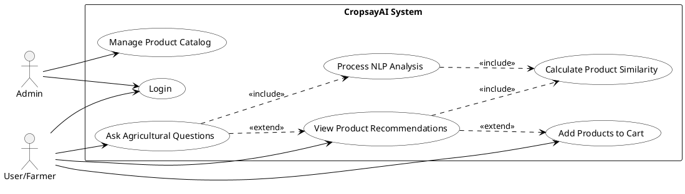
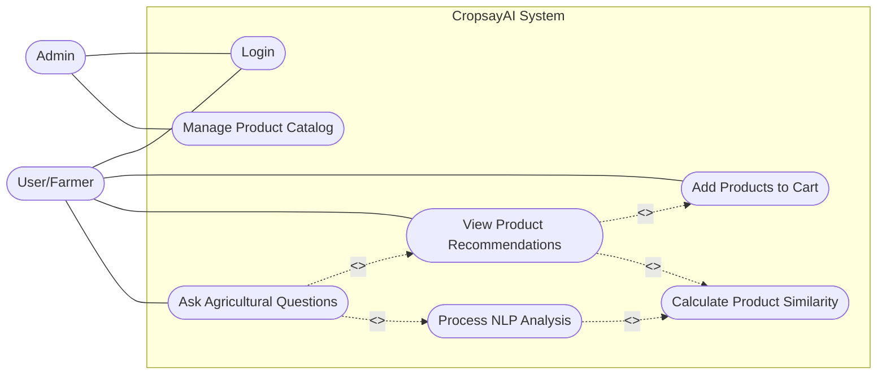

# CropsayAI System Use Case Diagram

## Alternative Mermaid Version

## Use Case Descriptions

### Primary Use Cases

1. **Ask Agricultural Questions**
   - **Description**: User can ask questions about farming, crops, and agricultural problems
   - **Primary Actor**: User/Farmer
   - **Note**: User/Farmer is the only actor for this use case after removing Gemini AI
   - **Includes**: Process NLP Analysis
 (ProcessNLP)
   - **Extends to**: View Product Recommendations (ViewRecommendations) (optional)

2. **View Product Recommendations**
   - **Description**: User can view products recommended based on their conversation
   - **Primary Actor**: User/Farmer
   - **Includes**: Calculate Product Similarity
 (CalculateSimilarity)
   - **Extended from**: Ask Agricultural Questions
 (AskQuestions)
   - **Extends to**: Add Products to Cart (AddToCart) (optional)

3. **Add Products to Cart**
   - **Description**: User can add recommended products to their shopping cart
   - **Primary Actor**: User/Farmer
   - **Extended from**: View Product Recommendations
 (ViewRecommendations)

4. **Manage Product Catalog**
   - **Description**: Admin can add, update, or remove products from the catalog
   - **Primary Actor**: Admin

5. **Process NLP Analysis**
   - **Description**: System analyzes user queries using NLP techniques
   - **Included by**: Ask Agricultural Questions
 (AskQuestions)
   - **Includes**: Calculate Product Similarity
 (CalculateSimilarity)

6. **Calculate Product Similarity**
   - **Description**: System uses KNN algorithm to find products similar to user query
   - **Included by**: Process NLP Analysis (ProcessNLP), View Product Recommendations
 (ViewRecommendations)

7. **Login**
   - **Description**: Users and admins authenticate to access the system
   - **Primary Actors**: Both User/Farmer and Admin

## Relationship Explanations

- **Association**: Simple line connecting an actor to a use case (e.g., User to Ask Agricultural Questions)
- **Include**: Dotted arrow with <<include>> stereotype, indicating mandatory behavior (e.g., Ask Agricultural Questions includes Process NLP Analysis)
- **Extend**: Dotted arrow with <<extend>> stereotype, indicating optional behavior (e.g., Ask Agricultural Questions extends to View Product Recommendations)