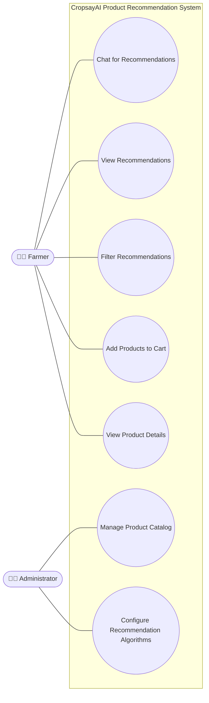
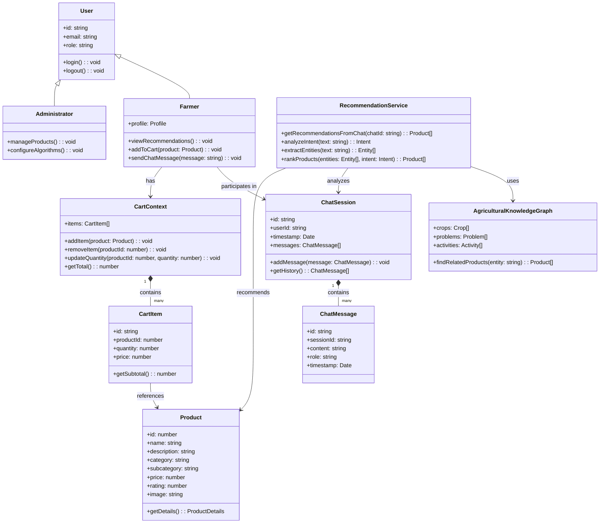
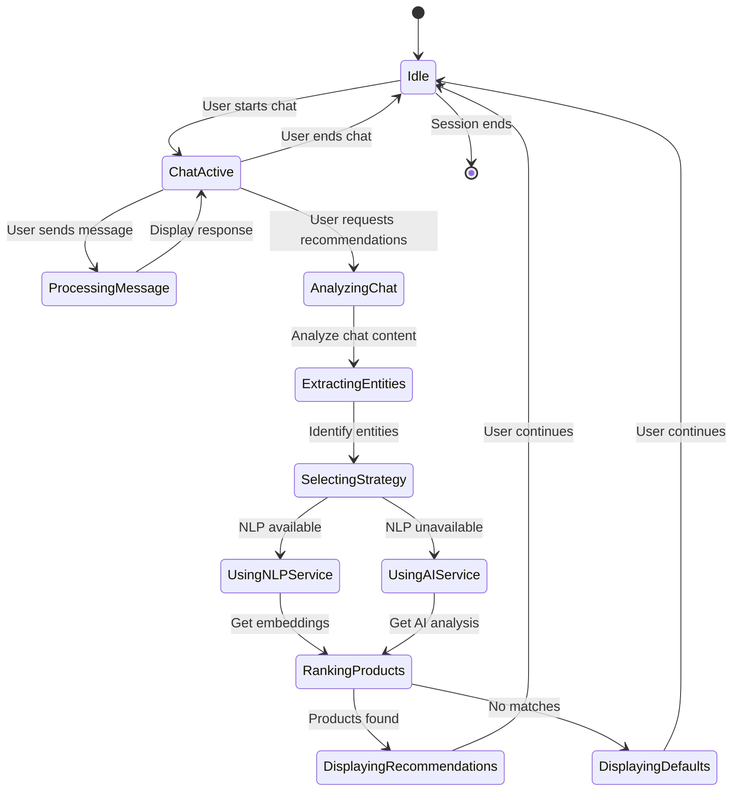
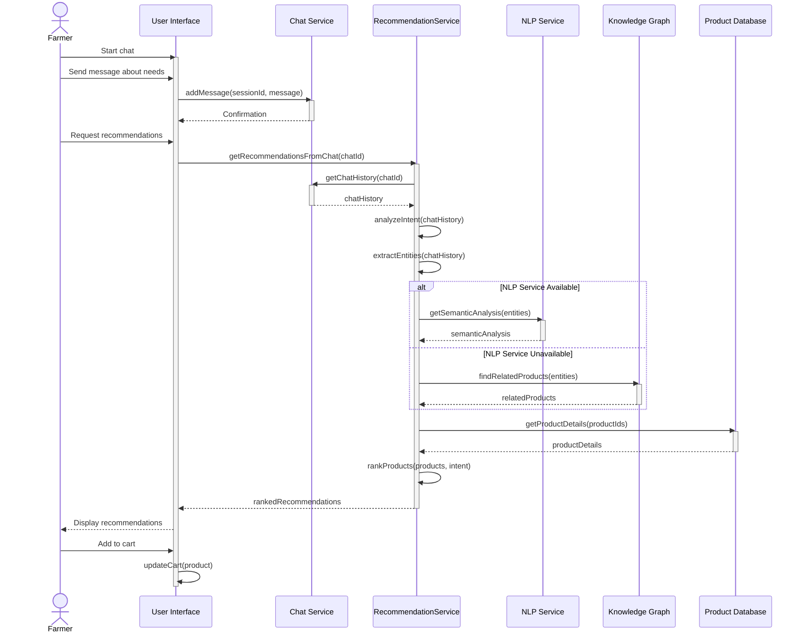
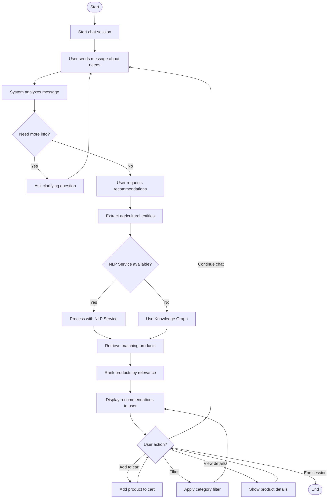
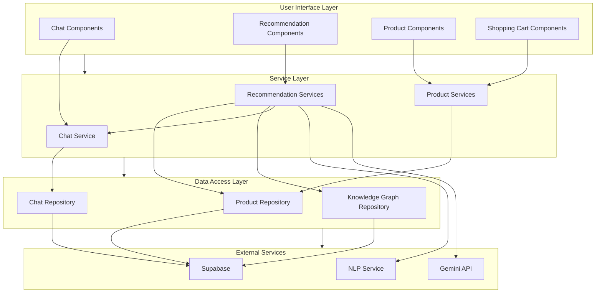

# CropsayAI Product Recommendation System Analysis and Design Diagrams

## 3.1.1 Use-Case Modeling

### Use-Case Diagram



### Use-Case Descriptions

#### UC1: Chat for Recommendations
**Actor:** Farmer  
**Description:** Farmers can chat about their agricultural needs to receive personalized recommendations.  
**Preconditions:** User is logged in.  
**Main Flow:**
1. Farmer navigates to chat interface
2. Farmer describes their agricultural situation or needs
3. System analyzes the chat content
4. System generates personalized product recommendations based on the chat
5. Farmer views recommended products
**Alternative Flows:**
- If chat content is unclear, system asks clarifying questions
- If no relevant products are found, system suggests alternatives
**Postconditions:** Farmer receives product recommendations based on their chat input.

#### UC2: View Recommendations
**Actor:** Farmer  
**Description:** Farmers can view personalized product recommendations based on their chat history.  
**Preconditions:** User has completed a chat session.  
**Main Flow:**
1. Farmer navigates to recommendations panel
2. System displays personalized product recommendations
3. Farmer browses through recommended products
**Alternative Flows:**
- If no chat history exists, system shows default recommendations
**Postconditions:** Farmer sees relevant agricultural products that address their needs.

#### UC3: Filter Recommendations
**Actor:** Farmer  
**Description:** Farmers can filter recommendations by category, price, or rating.  
**Preconditions:** User is viewing recommendations.  
**Main Flow:**
1. Farmer selects filter criteria
2. System applies filters to recommendations
3. System displays filtered recommendations
**Alternative Flows:**
- If no products match filters, system shows a message
**Postconditions:** Farmer sees filtered recommendations.

#### UC4: Add Products to Cart
**Actor:** Farmer  
**Description:** Farmers can add recommended products to their shopping cart.  
**Preconditions:** User is viewing product recommendations.  
**Main Flow:**
1. Farmer selects a recommended product
2. Farmer clicks "Add to Cart" button
3. System adds product to farmer's cart
4. System updates cart count and total
**Alternative Flows:**
- Farmer can adjust quantity of products in cart
- Farmer can remove products from cart
**Postconditions:** Selected products are added to farmer's shopping cart.

#### UC5: View Product Details
**Actor:** Farmer  
**Description:** Farmers can view detailed information about a product.  
**Preconditions:** User is viewing recommendations.  
**Main Flow:**
1. Farmer clicks on a product
2. System displays detailed product information
3. Farmer reviews product details
**Alternative Flows:**
- Farmer can return to recommendations list
**Postconditions:** Farmer has detailed information about the product.

#### UC6: Manage Product Catalog
**Actor:** Administrator  
**Description:** Administrators can add, update, or remove products from the catalog.  
**Preconditions:** Administrator is logged in.  
**Main Flow:**
1. Administrator navigates to product management section
2. Administrator can view existing products
3. Administrator can add new products with details
4. Administrator can update product information
5. Administrator can remove products from catalog
**Alternative Flows:**
- Administrator can import products in bulk
- Administrator can categorize products
**Postconditions:** Product catalog is updated with changes.

#### UC7: Configure Recommendation Algorithms
**Actor:** Administrator  
**Description:** Administrators can configure and tune recommendation algorithms.  
**Preconditions:** Administrator is logged in.  
**Main Flow:**
1. Administrator navigates to recommendation settings
2. Administrator selects algorithm parameters
3. Administrator adjusts weights and thresholds
4. System applies new configuration
**Alternative Flows:**
- Administrator can reset to default settings
- Administrator can A/B test different configurations
**Postconditions:** Recommendation algorithms are configured according to administrator's specifications.

## 3.1.3 Object Modeling: Object & Class Diagram

The class diagram illustrates the key classes and their relationships in the CropsayAI Product Recommendation System:



## 3.1.4 Dynamic Modeling: State & Sequence Diagrams

### State Diagram

The state diagram illustrates the states of the chat-based recommendation system:



### Sequence Diagram

The sequence diagram illustrates the process of generating product recommendations from chat:



## 3.1.5 Process Modeling: Activity Diagram

The activity diagram illustrates the process of generating recommendations from chat:



## 3.2.1 Refinement of Classes and Objects

The refined class diagram shows the strategy pattern implementation for recommendation algorithms:

```mermaid
classDiagram
    class RecommendationStrategy {
        <<interface>>
        +getRecommendations(chatHistory: ChatMessage[], limit: number): Product[]
    }
    
    class KNNRecommendationStrategy {
        -extractFeatures(text: string): number[]
        -calculateDistance(vector1: number[], vector2: number[]): number
        +getRecommendations(chatHistory: ChatMessage[], limit: number): Product[]
    }
    
    class NLPRecommendationStrategy {
        -calculateTfIdf(document: string, allDocuments: string[]): Map<string, number>
        -cosineSimilarity(vector1: Map<string, number>, vector2: Map<string, number>): number
        +getRecommendations(chatHistory: ChatMessage[], limit: number): Product[]
    }
    
    class KnowledgeGraphRecommendationStrategy {
        -extractEntities(text: string): Entity[]
        -scoreProducts(entities: Entity[], products: Product[]): ScoredProduct[]
        +getRecommendations(chatHistory: ChatMessage[], limit: number): Product[]
    }
    
    class GeminiRecommendationStrategy {
        -generatePrompt(chatHistory: ChatMessage[], categories: string[]): string
        -parseResponse(response: string): AnalysisResult
        +getRecommendations(chatHistory: ChatMessage[], limit: number): Product[]
    }
    
    class RecommendationService {
        -strategies: Map<string, RecommendationStrategy>
        -productRepository: ProductRepository
        -knowledgeGraph: AgriculturalKnowledgeGraphService
        +registerStrategy(name: string, strategy: RecommendationStrategy): void
        +getRecommendationsFromChat(chatId: string, limit: number): Product[]
        -selectStrategy(chatHistory: ChatMessage[]): RecommendationStrategy
        -fallbackToDefault(limit: number): Product[]
    }
    
    class ProductRepository {
        +getAll(): Product[]
        +getByCategory(category: string): Product[]
        +getBySubcategory(subcategory: string): Product[]
        +getById(id: number): Product
        +search(query: string): Product[]
    }
    
    class AgriculturalKnowledgeGraphService {
        +getCrops(): Crop[]
        +getProblems(): Problem[]
        +getActivities(): Activity[]
        +findRelatedProducts(entity: string, type: string): string[]
    }
    
    class ChatService {
        +createSession(userId: string): ChatSession
        +addMessage(sessionId: string, content: string, role: string): ChatMessage
        +getSessionHistory(sessionId: string): ChatMessage[]
        +analyzeChat(sessionId: string): ChatAnalysis
    }
    
    RecommendationStrategy <|.. KNNRecommendationStrategy
    RecommendationStrategy <|.. NLPRecommendationStrategy
    RecommendationStrategy <|.. KnowledgeGraphRecommendationStrategy
    RecommendationStrategy <|.. GeminiRecommendationStrategy
    
    RecommendationService --> RecommendationStrategy: uses
    RecommendationService --> ProductRepository: uses
    RecommendationService --> AgriculturalKnowledgeGraphService: uses
    RecommendationService --> ChatService: uses
    
    KnowledgeGraphRecommendationStrategy --> AgriculturalKnowledgeGraphService: uses
```



## 3.2.2 Component Diagram

The component diagram illustrates the main components of the CropsayAI Chat-based Product Recommendation System:



## 3.2.3 Deployment Diagram

The deployment diagram illustrates how the CropsayAI Chat-based Product Recommendation System is deployed:

```mermaid
flowchart TD
    subgraph CD["Client Device"]
        Browser["Web Browser\n(React Application)"]
    end
    
    subgraph WS["Web Server"]
        WebApp["Web Application Server\n(Node.js)"]
        
        subgraph FE["Frontend"]
            ReactApp["React Application"]
            ChatUI["Chat UI Components"]
            RecommendationUI["Recommendation UI Components"]
        end
        
        subgraph BE["Backend Services"]
            ChatService["Chat Service"]
            RecEngine["Recommendation Engine"]
            ProductService["Product Service"]
        end
    end
    
    subgraph NS["NLP Server"]
        PythonService["Python NLP Service\n(FastAPI)"]
        TransformerModels["Transformer Models"]
        Embeddings["Text Embeddings"]
    end
    
    subgraph ES["External Services"]
        GeminiAPI["Google Gemini API"]
        SupabaseDB["Supabase Database"]
    end
    
    Browser <--> WebApp
    ReactApp --> ChatUI
    ReactApp --> RecommendationUI
    WebApp --> ChatService
    WebApp --> RecEngine
    WebApp --> ProductService
    ChatService --> RecEngine
    RecEngine <--> PythonService
    PythonService --> TransformerModels
    PythonService --> Embeddings
    RecEngine <--> GeminiAPI
    ChatService <--> SupabaseDB
    ProductService <--> SupabaseDB