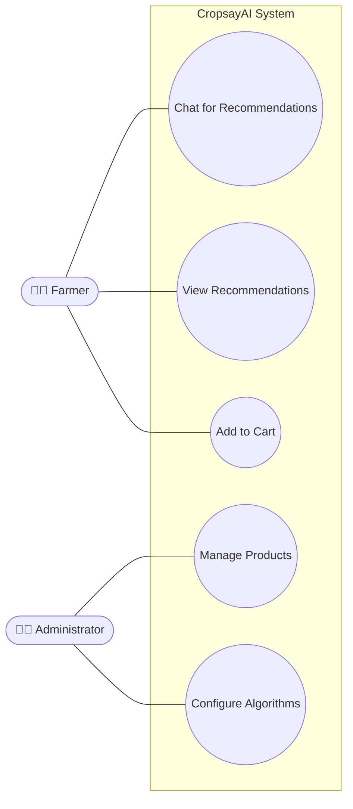
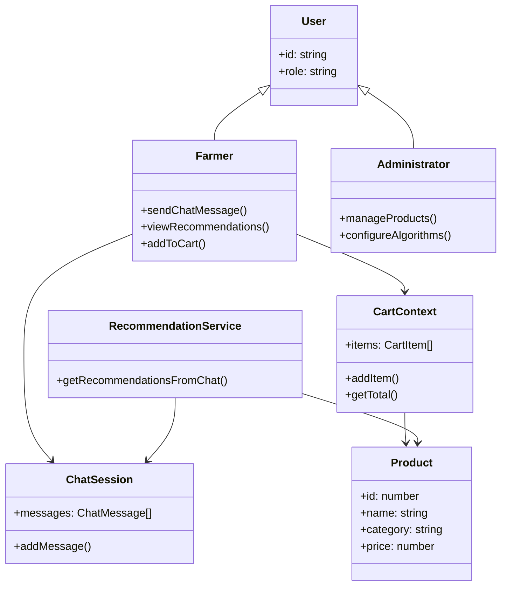
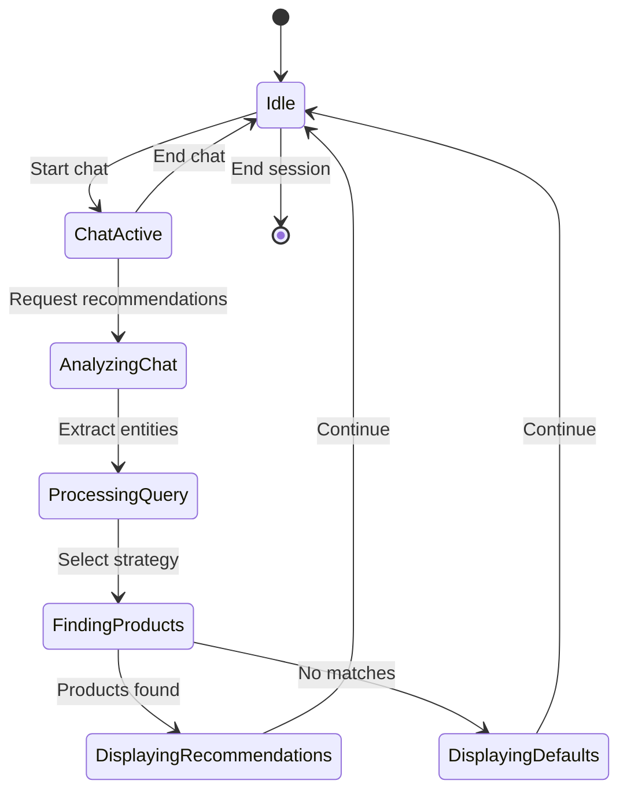
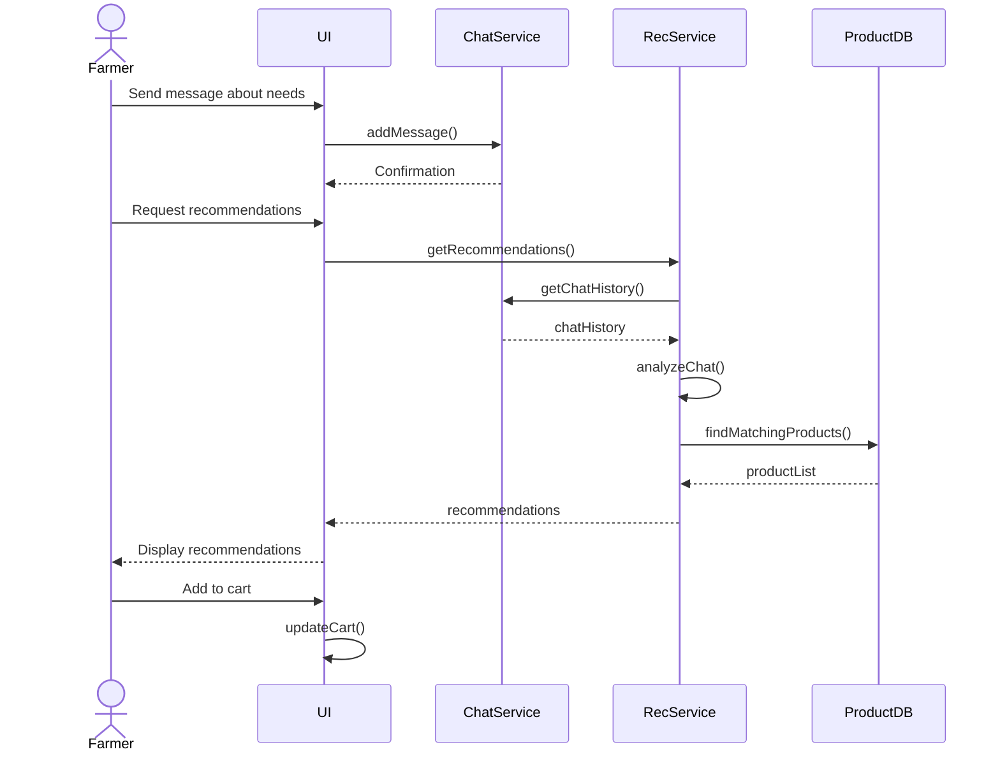
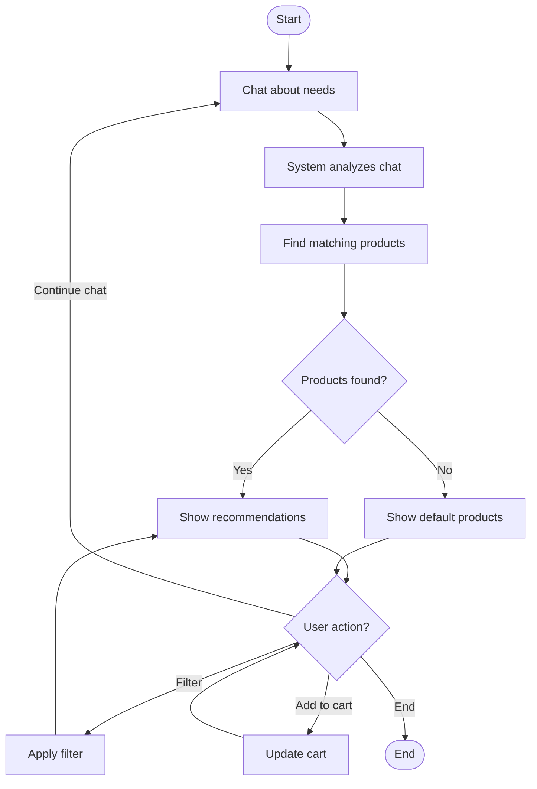
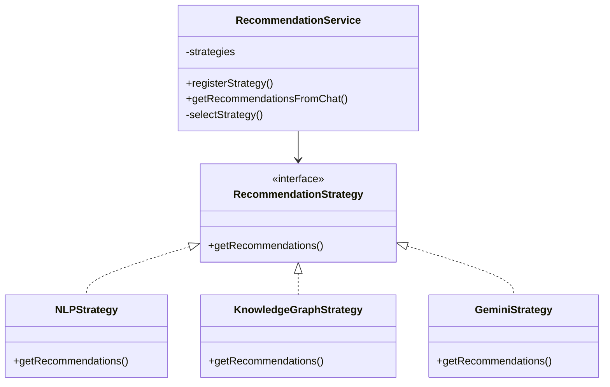
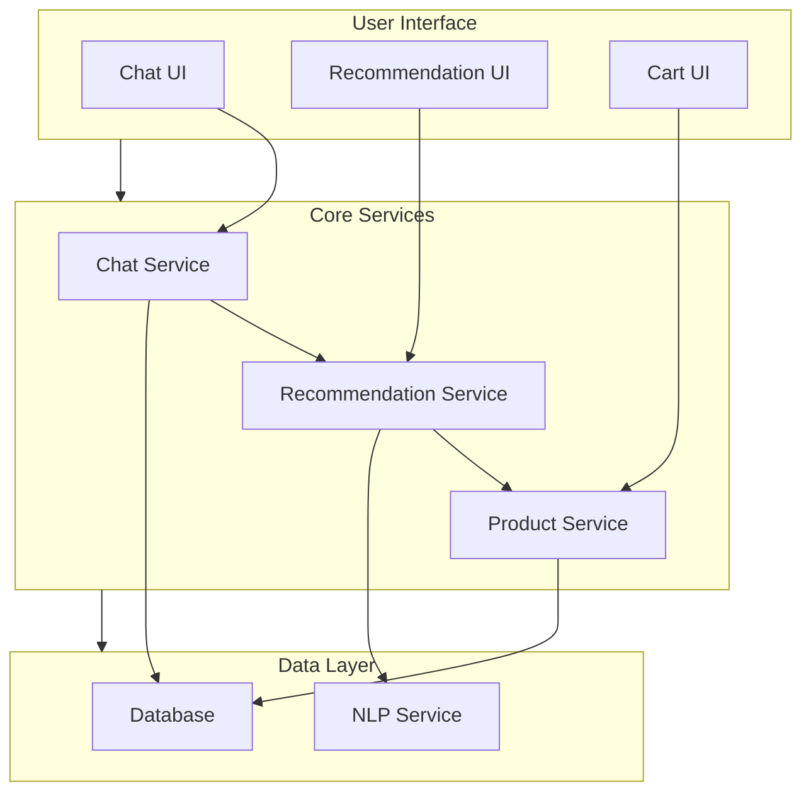

# CropsayAI Product Recommendation System Analysis and Design Diagrams

## 3.1.1 Use-Case Modeling

### Use-Case Diagram



### Use-Case Descriptions

#### UC1: Chat for Recommendations
**Actor:** Farmer  
**Description:** Farmers can chat about their agricultural needs to receive personalized recommendations.  
**Main Flow:**
1. Farmer describes their agricultural situation or needs
2. System analyzes the chat content
3. System generates personalized product recommendations
4. Farmer views recommended products

#### UC2: View Recommendations
**Actor:** Farmer  
**Description:** Farmers can view and filter personalized product recommendations.  
**Main Flow:**
1. System displays personalized product recommendations
2. Farmer can filter recommendations by category or price
3. Farmer can view detailed product information

#### UC3: Add to Cart
**Actor:** Farmer  
**Description:** Farmers can add recommended products to their shopping cart.  
**Main Flow:**
1. Farmer selects a recommended product
2. Farmer adds product to cart
3. System updates cart count and total

#### UC4: Manage Products
**Actor:** Administrator  
**Description:** Administrators can manage the product catalog.  
**Main Flow:**
1. Administrator can add, update, or remove products
2. Administrator can categorize products
3. Administrator can view product statistics

#### UC5: Configure Algorithms
**Actor:** Administrator  
**Description:** Administrators can configure recommendation algorithms.  
**Main Flow:**
1. Administrator selects algorithm parameters
2. Administrator adjusts weights and thresholds
3. System applies new configuration

## 3.1.3 Object Modeling: Object & Class Diagram



## 3.1.4 Dynamic Modeling: State & Sequence Diagrams

### State Diagram



### Sequence Diagram



## 3.1.5 Process Modeling: Activity Diagram



## 3.2.1 Refinement of Classes and Objects



## 3.2.2 Component Diagram



## 3.2.3 Deployment Diagram

```mermaid
flowchart TD
    Client["Client Browser"]
    
    subgraph Server["Application Server"]
        WebApp["Web Application"]
        API["API Services"]
    end
    
    subgraph Services["External Services"]
        NLP["NLP Service"]
        Database["Database"]
        AI["AI Service"]
    end
    
    Client <--> WebApp
    WebApp --> API
    API <--> Services