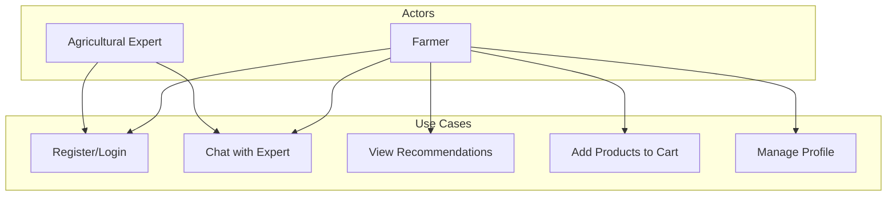
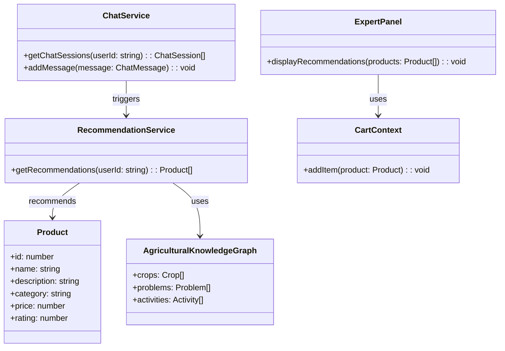
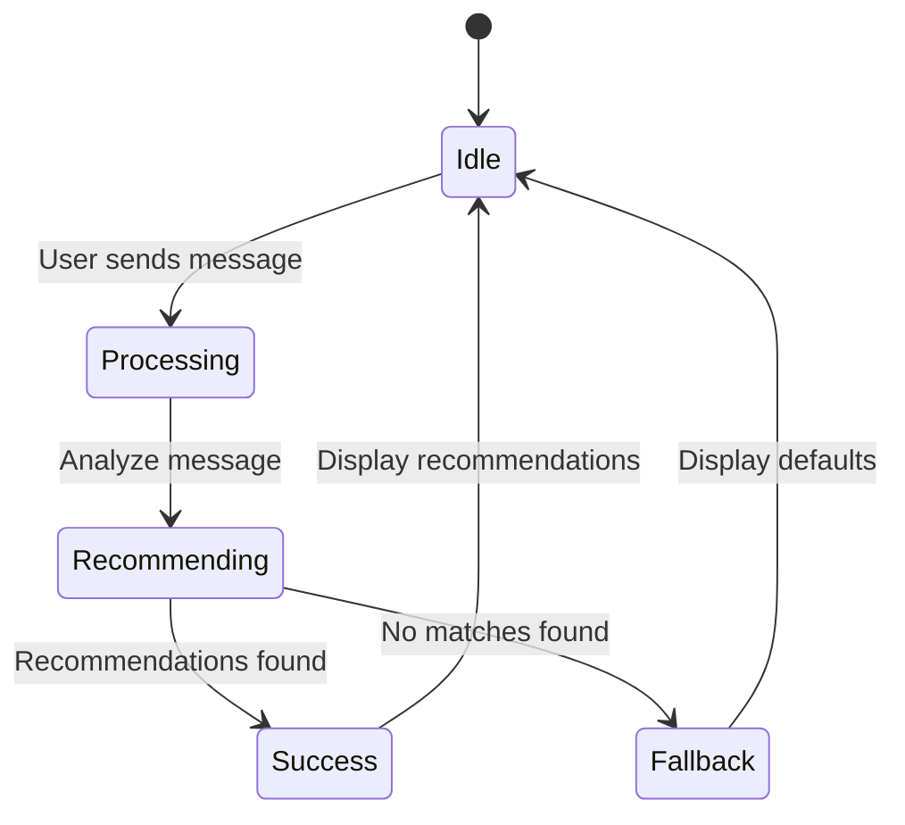
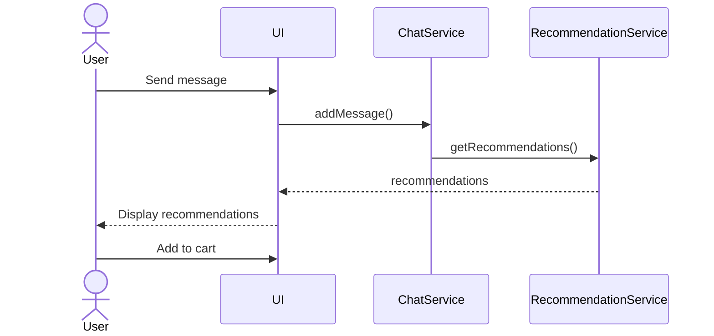
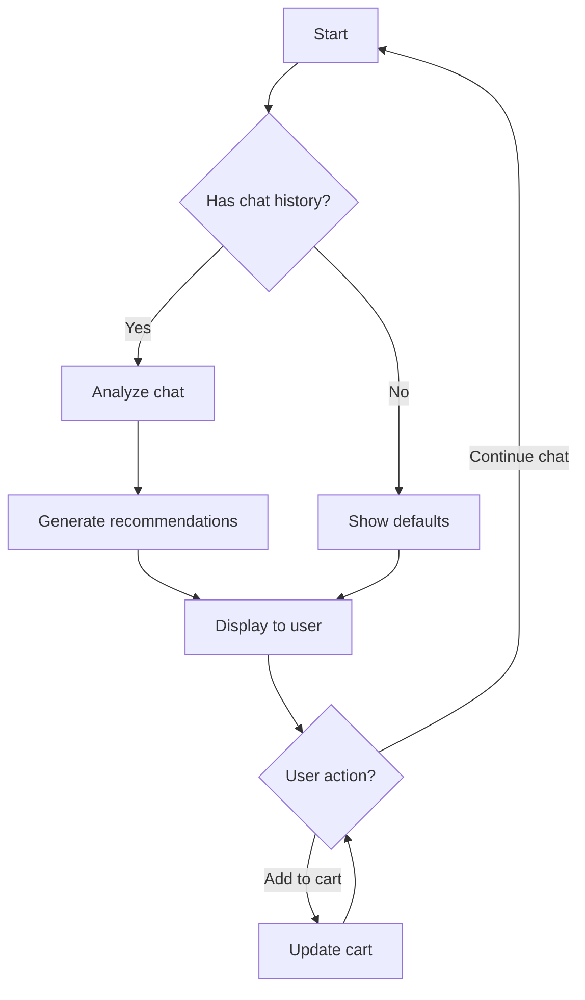
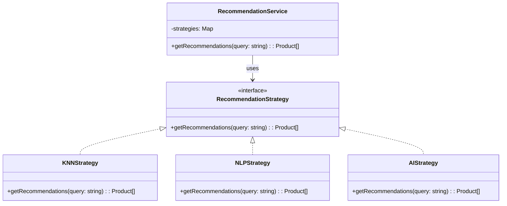
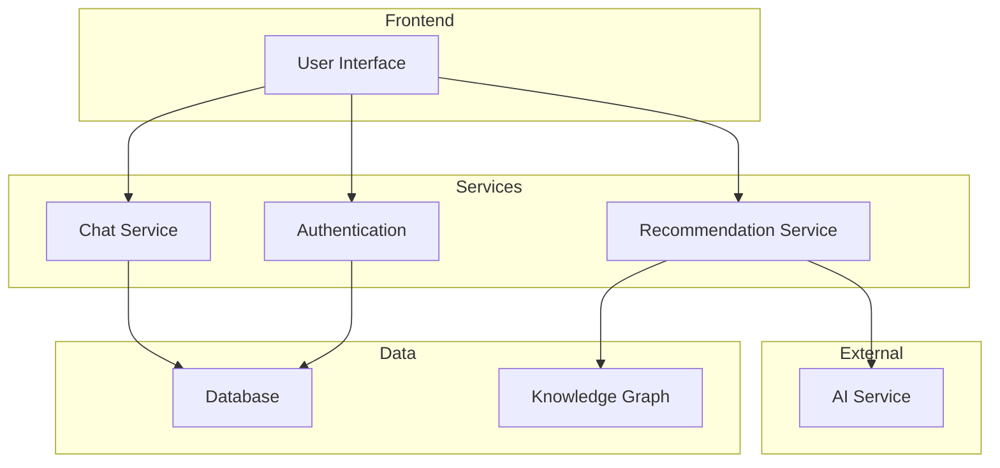

# CropsayAI System Analysis and Design Diagrams

## 3.1.1 Use-Case Modeling

### Use-Case Diagram

The following use-case diagram illustrates the main actors and use cases in the CropsayAI system:



### Use-Case Descriptions

#### UC1: Register/Login
**Actor:** Farmer, Expert  
**Description:** Users can create an account or log in to an existing account.  
**Main Flow:**
1. User opens the application
2. User selects "Register" or "Login"
3. System authenticates the user
4. System grants access to the application

#### UC2: Chat with Expert
**Actor:** Farmer, Expert  
**Description:** Farmers can chat with agricultural experts to get advice on farming issues.  
**Main Flow:**
1. Farmer selects an expert
2. Farmer sends messages describing their agricultural situation
3. Expert responds with advice
4. System analyzes chat content for product recommendations

#### UC3: View Recommendations
**Actor:** Farmer  
**Description:** Farmers can view personalized product recommendations based on their chat history.  
**Main Flow:**
1. System analyzes farmer's chat history
2. System generates personalized product recommendations
3. Farmer views recommended products
4. Farmer can filter recommendations by category

#### UC4: Add Products to Cart
**Actor:** Farmer  
**Description:** Farmers can add recommended products to their shopping cart.  
**Main Flow:**
1. Farmer selects a recommended product
2. Farmer adds product to cart
3. System updates cart count and total

#### UC5: Manage Profile
**Actor:** Farmer  
**Description:** Farmers can view and update their profile information.  
**Main Flow:**
1. Farmer navigates to profile section
2. Farmer edits information as needed
3. System saves changes

## 3.1.3 Object Modeling: Object & Class Diagram

The simplified class diagram shows the core classes and their relationships:



## 3.1.4 Dynamic Modeling: State & Sequence Diagrams

### State Diagram

The simplified state diagram for the recommendation system:



### Sequence Diagram

The simplified sequence diagram for generating recommendations:



## 3.1.5 Process Modeling: Activity Diagram

The simplified activity diagram for the recommendation process:



## 3.2.1 Refinement of Classes and Objects

The simplified strategy pattern implementation:



## 3.2.2 Component Diagram

The simplified component diagram:



## 3.2.3 Deployment Diagram

The simplified deployment diagram:

```mermaid
graph TD
    Client[Client Browser]
    WebServer[Web Server]
    NLPServer[NLP Server]
    Database[Database]
    
    Client <--> WebServer: HTTPS
    WebServer <--> NLPServer: HTTP
    WebServer <--> Database: HTTPS