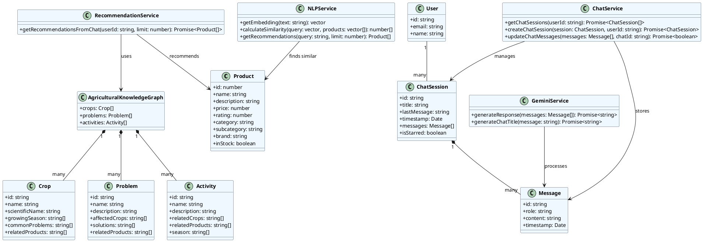
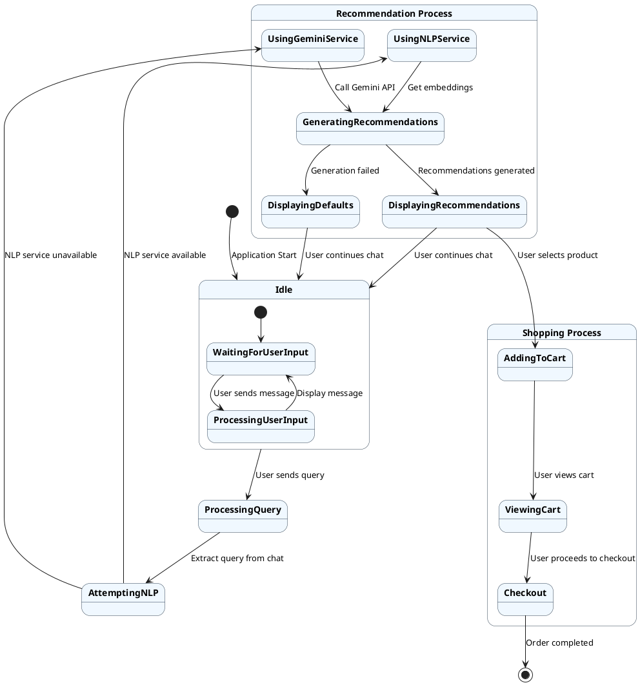
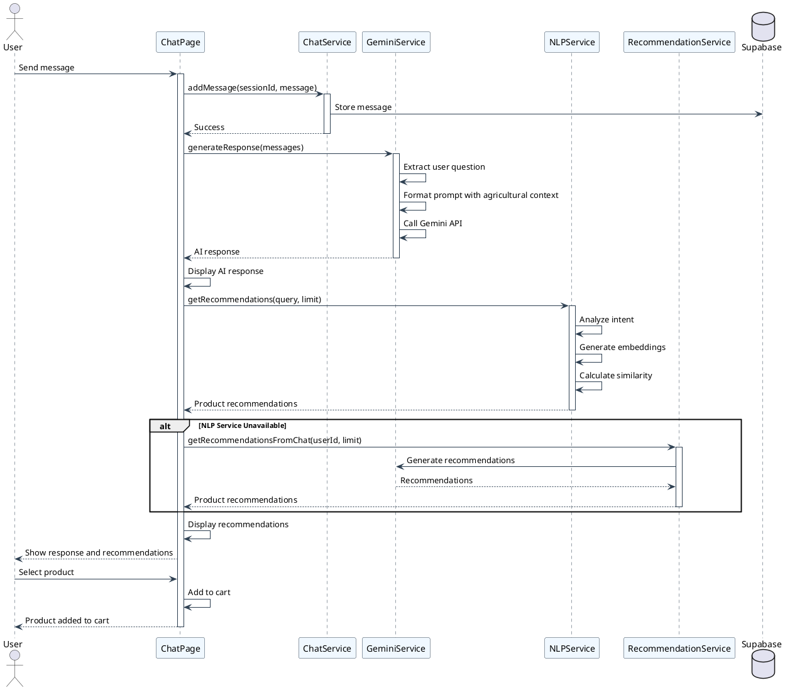
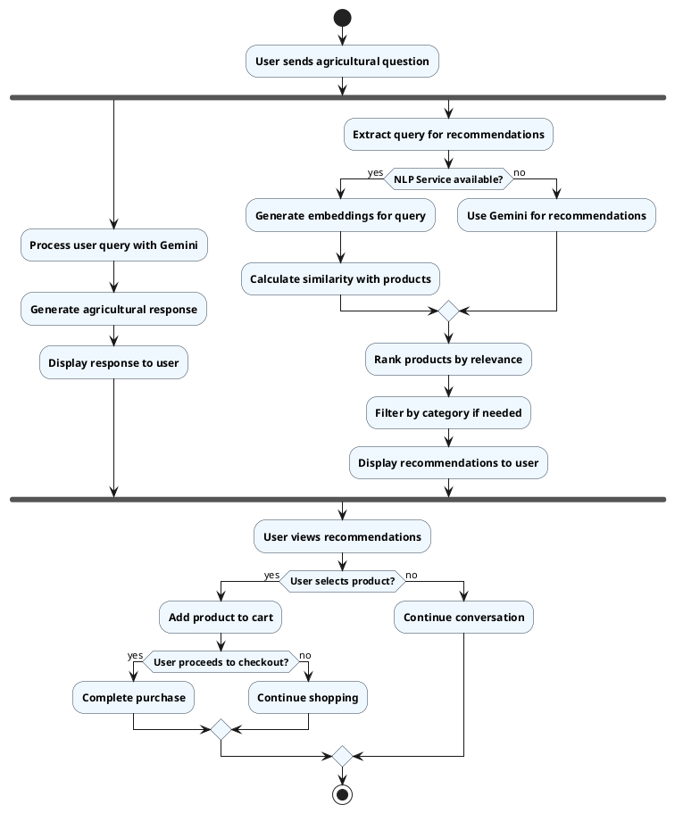
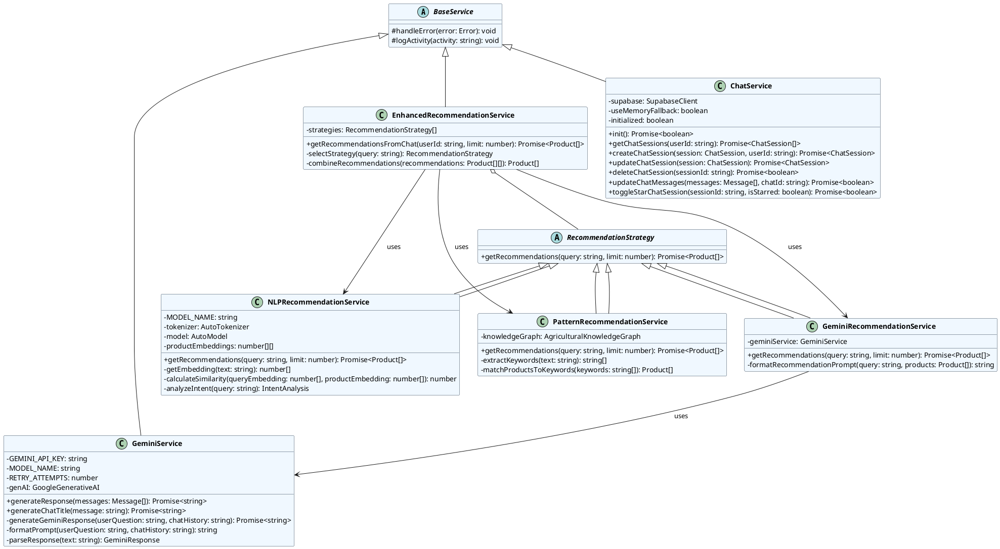
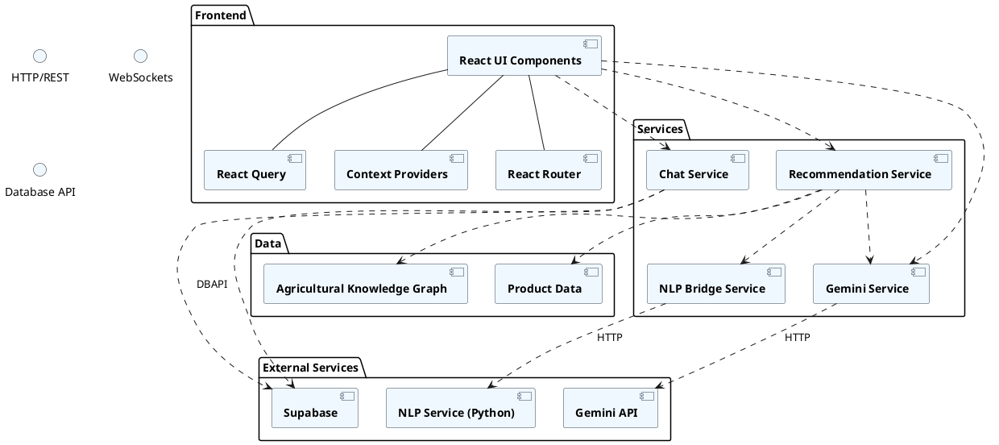
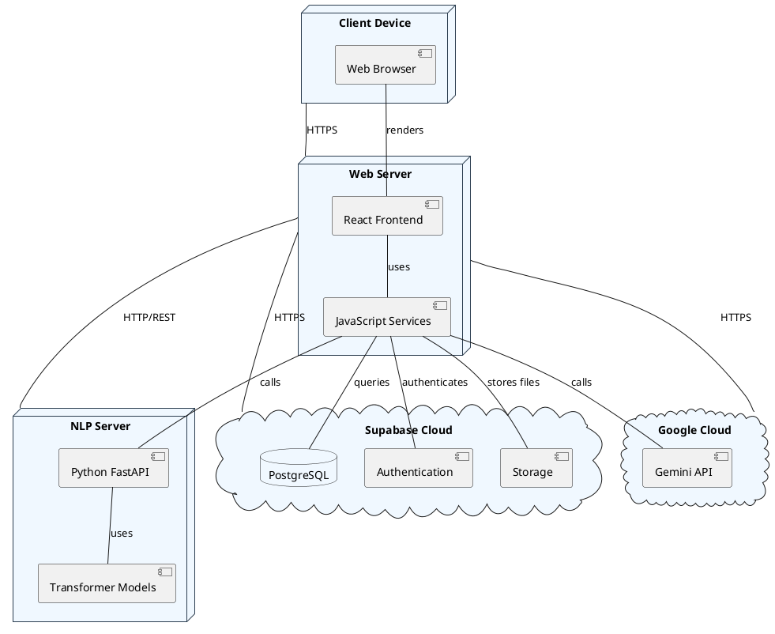

# CropsayAI UML Diagrams

This document contains various UML diagrams that illustrate the architecture, structure, and behavior of the CropsayAI system.

## 1. Object & Class Diagram

**Description**: The class diagram shows the main domain entities and services in the CropsayAI system. It illustrates how the agricultural knowledge graph contains crops, problems, and activities, and how these relate to products. The diagram also shows the chat-related classes (User, ChatSession, Message) and the service classes that implement the core functionality (GeminiService, RecommendationService, NLPService, ChatService).

## 2. State Diagram

**Description**: The state diagram illustrates the different states of the CropsayAI system during user interaction. It shows the idle state where the system waits for user input, the recommendation process that involves either NLP or Gemini services, and the shopping process where users can add products to cart and checkout. The diagram highlights the fallback mechanisms when certain services are unavailable.

## 3. Sequence Diagram

**Description**: The sequence diagram shows the interaction between the user, UI components, and various services during a typical chat session. It illustrates how a user message flows through the system, triggering the Gemini service for generating responses and the NLP service for product recommendations. The diagram also shows the fallback to the recommendation service when the NLP service is unavailable.

## 4. Activity Diagram

**Description**: The activity diagram illustrates the flow of activities in the CropsayAI system when a user interacts with it. It shows how user queries are processed in parallel for both generating responses and product recommendations. The diagram highlights decision points such as service availability and user actions, and shows the different paths the flow can take based on these decisions.

## 5. Refinement of Classes and Objects

**Description**: This refined class diagram focuses on the service layer of the CropsayAI system, showing how the recommendation system is implemented using the Strategy pattern. It illustrates the base classes and their specialized implementations, such as different recommendation strategies (Pattern-based, NLP-based, Gemini-based). The diagram also shows how the EnhancedRecommendationService combines these strategies to provide robust recommendations.

## 6. Component Diagram

**Description**: The component diagram shows the high-level components of the CropsayAI system and their interactions. It illustrates how the frontend components (React UI, Router, Query, Context) interact with the service layer (Chat Service, Gemini Service, Recommendation Service, NLP Bridge). The diagram also shows the external services (Gemini API, Supabase, NLP Service) and data components (Product Data, Agricultural Knowledge Graph) that the system depends on.

## 7. Deployment Diagram

**Description**: The deployment diagram illustrates how the CropsayAI system is deployed across different physical or virtual nodes. It shows the client device running a web browser, the web server hosting the React frontend and JavaScript services, the NLP server running Python FastAPI and transformer models, and cloud services like Google Cloud (for Gemini API) and Supabase Cloud (for database, authentication, and storage). The diagram also shows the communication protocols between these nodes.